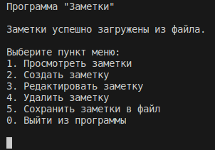

# Приложение "Заметки"

## https://github.com/InAnotherLife/notes

## Стек: С++, GCC 11.4.0, Ubuntu 22.04

## 1. Описание
Приложение "Заметки" разработано на языке С++ стандарта C++17. Код программы находится в папке src.\
Приложение имеет консольный интерфейс.\
Сборка программы осуществляется с помощью Makefile. Цели:
* all или install - компиляция и запуск программы
* uninstall - удалить программу
* clean - удалить временные файлы, созданные в процессе компиляции 
* rebuild - последовательное выполнение целей clean, install
* clang-format - автоматическое форматирование исходного кода (стиль Google)
* linter - проверка исходного кода на соответствие стандартам и правилам
* cppcheck - запуск статического анализатора кода для поиска ошибок и потенциальных проблем

## 2. Меню приложения

При запуске программы заметки автоматически загружаются из файла (по-умолчанию файл notes.txt).\
Далее можно работать с заметками: просматривать, создавать, редактировать, удалять.\
Перед выходом их программы необходимо сохранить заметки в файл.
