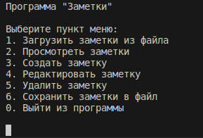

# Приложение "Заметки"

## https://github.com/InAnotherLife/notes

## Стек: С++, GCC 11.4.0, Ubuntu 22.04

## 1. Описание
Приложение "Заметки" разработано на языке С++ стандарта C++17. Код программы находится в папке src.\
Приложение имеет простой консольный интерфейс.\
Сборка программы осуществляется с помощью Makefile:
* all или install - компиляция и запуск программы
* clean - удалить из каталога программу и все файлы, полученные в результате компиляции
* clang - форматирование исходного кода, стиль Google
* linter - проверка исходного кода на соответствие стилю Google
* cppcheck - запуск статического анализатора кода для поиска ошибок

## 2. Меню приложения

При запуске программы необходимо загрузить заметки из файла, по-умолчанию файл notes.txt.\
Далее можно работать с заметками: создавать, редактировать, удалять.\
Перед выходом их программы необходимо сохранить заметки в файл.
